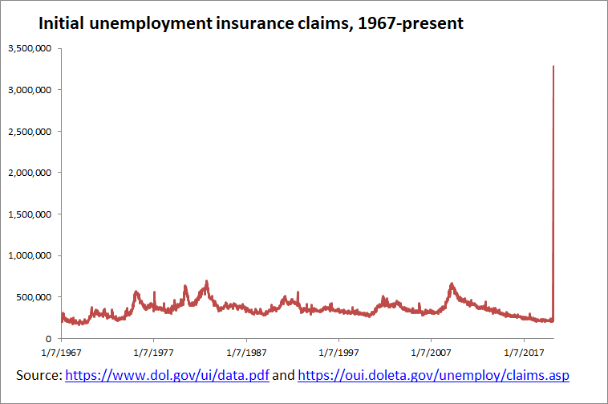

# The Weirdness in the Unemployment Statistics
Hi, my name is Joseph B. Vadella and this is a short write-up on some statistical weirdness that I found in the March 2020 Bureau of Labor Statistics official measures of U1-U6 known as the "Alternative Measures of Labor Underutilizaton"  
   
## Prologue
I'm sure many people have seen this graph  
